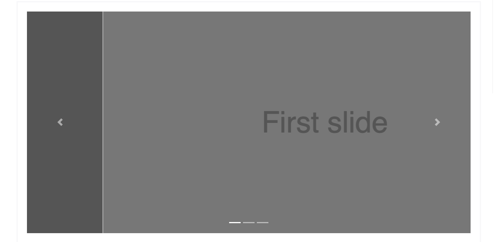
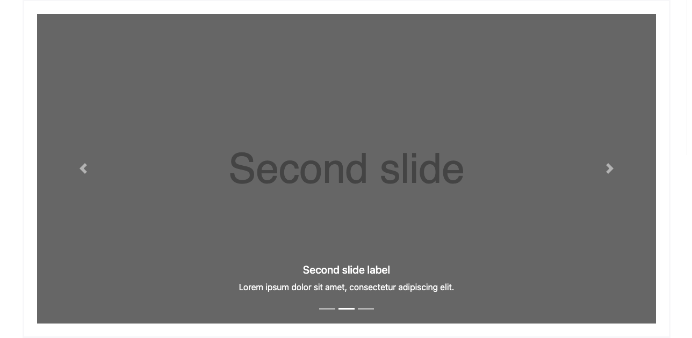

# Carousel | Documentation | Feasibility Study

>A slideshow component for cycling through elements—images or slides of text—like a carousel.

## Index

- What and Why – Brief Explanation
- Rationales  
- Feasibility Study 
- Web component and its API
- References and Notes

___

### What and Why - Brief Explanation

Brief about types of carousels available in major frameworks:

- Slide only carousels.
- With control carousels. 
- With indicators carousels. 
- With caption and content carousels. 

___

*Figure: Slide only carousel*


___

*Figure: With controls carousel*


___

Figure: With indicators carousel


___

Figure: With caption and content carousel


___

## Rationales

There are major questions though; I went through some common libraries, w3c, and some famous UI frameworks.

- At least, I could not get this information in my search if this feature is planned or requested in the discussion forum.

**[ARIA Authoring Practices Guide (APG) – Click here for the complete article](https://www.w3.org/TR/wai-aria-practices/#carousel)**

- Typically, one slide is displayed at a time, and users can activate the next or previous slide. In some implementations, rotation automatically starts when the page loads.
- Slides may contain any type of content.
- Ensuring all users can easily control and are not adversely affected by slide rotation is an essential aspect of making carousels accessible. And that is quite a task to do carefully.
- For instance, the screen reader experience can be confusing and disorienting if slides that are not visible on the screen are incorrectly hidden, e.g., displayed off-screen.
- If slides rotate automatically and a screen reader user is not aware of the rotation, the user may read an element on slide one, execute the screen reader command for the next element, and, instead of hearing the next element on slide one, hear an element from slide two without any knowledge that the element just announced is from an entirely new context.

**Performance**

- Carousels typically have images and animations. Additionally, it is a processing-heavy operation. For example – complete hiding and showing elements/slides.
- What bounds/limitations must be placed on the number of items or image size, type, and resolution.

### Feasibility Study:

1. **Components**

- A carousel container element encompasses all components (Carousel controls, and slides)
- Slide/Slides
- Rotation Control – Control to start/stop automatic slide rotation.
- Next slide control
- Previous slide control
- Slide picker control(s) – Group to pick a slide (indicator).

**Nice to Have**

- Label/Captions – Textual information over slides (TODO – Plan later)
- Active Link – Clicking text/slide – Redirect (TODO – Plan later)

2. **Accessibility**

- Set on container `aria-roledescription` set to – carousel.
- Labels, its accessible label is provided by property – `aria-labelledby` / `aria-label`. More on it [here](https://www.w3.org/TR/wai-aria-practices/#carousel)
- Rotation control should have an accessible label. Also, property `aria-label`.
- Each slide has an accessible name (unique). Also, accessibility properties.
- Color contrast of Text and Rotation controls.
- Screen reader announcement of slide changes.
- If slides/elements of the Carousel have some message, it should be as caption. Images including text cannot be read by screen readers. (TODO – Can be brainstormed later)

3. **Keyboard Interaction (Basic Interactions)**

- Toggle the auto-rotation of slides – Recommended (Enter or Space)
- Moves focus through interactive elements – Recommended (Tab)
- Rotation control – Recommended (Tab)

4. **Standards for components**

- As per ING standards, the minimum size of a button should be – 44px by 44px.
- ING also has contrast ratio requirements for text.
- Standards for Images / Content
  - Pixels (TODO: Could not find ING Guidelines yet) – [https://brandportal.ing.com](https://brandportal.ing.com) might have some more information. Industry Standard 1080 x 1080px / Aspect Ratio – 1:1

5. **Performance considerations**

- A carousel is a UX component that displays content in a slideshow-like manner. Large, above-the-fold carousels often contain a page's Largest Contentful Paint (LCP) element,
- Avoid use of non-composited animations that can contribute to Cumulative Layout Shift (CLS). On pages with autoplaying carousels, this has the potential to cause infinite layout shifts.
- Keep it simple mostly HTML. Avoid costly JS operations.

## Web Component and its API:

**Name:**  UrWcCarousel

**Html:** `<ur-wc-carousel></ur-wc-carousel>`

**Public API:**

- Object `<Configuration>`
- Map `<Slides>`
  ```json
  [
    {
      "imgUrl": ""
    }
  ]

### References:

- [APG - Carousel (Slide Show or Image Rotator) Pattern](https://www.w3.org/TR/wai-aria-practices/#carousel)
- [Auto Rotating Image Carousel Example with Buttons for Slide Control (APG) with Accessibility best practices](https://www.w3.org/WAI/tutorials/carousels/working-example/)
- Complete Inspirational Example
  - [Working Example](https://www.w3.org/WAI/tutorials/carousels/working-example/)
  - [Full Code](https://www.w3.org/WAI/tutorials/carousels/full-code/)
- [Performance considerations – Web vital patterns (Web Dev)](https://web.dev/patterns/web-vitals-patterns/carousels)
  - [Carousel Best Practices](https://web.dev/articles/carousel-best-practices)
- [Orange Juice, Contribution guidelines](https://github.com/ing-bank/lion)
- [Orange Juice, Image component – might be useful](https://github.com/ing-bank/lion/tree/main/packages/carousel)

### Notes (For product and later use):

**General considerations**

Carousels work well in situations where using additional vertical space to display additional content is not an option. Carousels on product pages are often a good example of this use case. However, carousels are not always used effectively.

- Carousels, particularly if they contain promotions or advance automatically, are easily mistaken for advertisements by users. Users tend to ignore advertisements—a phenomenon known as banner blindness.
- Carousels are often used to placate multiple departments and avoid making decisions about business priorities. As a result, carousels can easily turn into a dumping ground for ineffective content.

